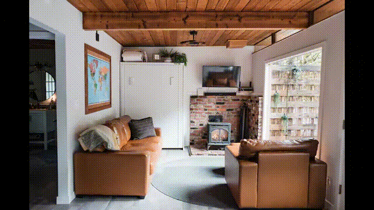

<div align="center">

# 🏡 Airbnb TourCraft AI — 3D Spatial Video Tour Generator

[](https://deepmind.google/technologies/gemini/)
[](https://cloud.google.com/vertex-ai)
[](https://github.com/google/agent-development-kit)
[](https://cloud.google.com/text-to-speech)
[](LICENSE)

<br/>

### 🎬 *Transforming static 2D real estate photos into photorealistic 3D spatial room walkthrough video tours with AI voiceover narration.*

<br/>



*3D Spatial Room Walkthrough Video generated directly from 2D listing photos using **Vertex AI Veo 3.1***

</div>

---

## 📖 Executive Summary & Overview

**Airbnb TourCraft AI** is an agentic AI video production platform built on the **Google Agent Development Kit (ADK)** framework. Powered by **Gemini 3.6 Flash**, it solves a major friction point in real estate marketing: **turning static 2D photos into continuous, photorealistic 3D spatial room walkthrough video tours**.

By orchestrating **Gemini 3.6 Flash**, **Vertex AI Veo 3.1**, and **Google Cloud Text-to-Speech**, the agent acts as an autonomous AI Director—analyzing room photos, planning camera flight paths, synthesizing 3D video clips with spatial parallax, generating voiceover narration, and stitching everything into a 1080p video package uploaded directly to Google Cloud Storage.

---

## 🍿 Live Demos & Sample Video Tours

### 🌟 Full 7-Room Stitched 3D Tour Package (with Voiceover)
> 🎬 **[Watch Full Property 3D AI Video Tour with Voiceover (1080p MP4)](https://storage.googleapis.com/qwiklabs-gcp-03-ae2ceb20cd60-public-tour-videos/full_property_3d_veo_tour_voiceover.mp4)**

<br/>

### 🎥 Individual 3D AI Room Scene Video Clips

| Scene | Room Space | Veo 3.1 3D Video Clip |
| :---: | :--- | :--- |
| **01** | 🛋️ **Sunlit Living Room** | 🎬 **[Play Living Room 3D Video](https://storage.googleapis.com/qwiklabs-gcp-03-ae2ceb20cd60-public-tour-videos/4465040356510722226/sample_0.mp4)** |
| **02** | 🍳 **Chef Kitchen** | 🎬 **[Play Kitchen 3D Video](https://storage.googleapis.com/qwiklabs-gcp-03-ae2ceb20cd60-public-tour-videos/883659396315306320/sample_0.mp4)** |
| **03** | 🛏️ **Master Bedroom** | 🎬 **[Play Master Bedroom 3D Video](https://storage.googleapis.com/qwiklabs-gcp-03-ae2ceb20cd60-public-tour-videos/4418851399995325039/sample_0.mp4)** |
| **04** | 🛁 **Full Spa Bathroom** | 🎬 **[Play Spa Bathroom 3D Video](https://storage.googleapis.com/qwiklabs-gcp-03-ae2ceb20cd60-public-tour-videos/17338547557530660932/sample_0.mp4)** |
| **05** | 🌲 **Private Outdoor Deck** | 🎬 **[Play Outdoor Deck 3D Video](https://storage.googleapis.com/qwiklabs-gcp-03-ae2ceb20cd60-public-tour-videos/4884678098165555434/sample_0.mp4)** |
| **06** | ♨️ **Private Hot Tub** | 🎬 **[Play Hot Tub 3D Video](https://storage.googleapis.com/qwiklabs-gcp-03-ae2ceb20cd60-public-tour-videos/18295272265328801438/sample_0.mp4)** |
| **07** | 🌳 **Lush Forest Backyard** | 🎬 **[Play Backyard 3D Video](https://storage.googleapis.com/qwiklabs-gcp-03-ae2ceb20cd60-public-tour-videos/5466190193047210232/sample_0.mp4)** |

---

## 🔬 Deep-Dive Architecture & AI Models Used

```
┌────────────────────────────────────────────────────────────────────────┐
│                   User Interaction (ADK Web UI)                        │
└───────────────────────────────────┬────────────────────────────────────┘
                                    │
                                    ▼
┌────────────────────────────────────────────────────────────────────────┐
│                    Google ADK Agent Orchestrator                       │
│                       (Gemini 3.6 Flash Model)                         │
└─────┬─────────────────────────────┬─────────────────────────────┬──────┘
      │                             │                             │
      ▼                             ▼                             ▼
┌───────────┐                ┌─────────────┐               ┌────────────┐
│ Scene Gen │                │ Veo 3.1 Gen │               │ Audio TTS  │
│ Tool      │                │ Tool        │               │ Tool       │
└─────┬─────┘                └──────┬──────┘               └─────┬──────┘
      │                             │                            │
      ▼                             ▼                            ▼
┌───────────┐                ┌─────────────┐               ┌────────────┐
│  Gemini   │                │ Vertex AI   │               │ Google     │
│ 3.6 Flash │                │  Veo 3.1    │               │ Cloud TTS  │
└─────┬─────┘                └──────┬──────┘               └─────┬──────┘
      │                             │                            │
      └──────────────────────┬──────┴────────────────────────────┘
                             │
                             ▼
┌────────────────────────────────────────────────────────────────────────┐
│                     ffmpeg Audio/Video Stitcher                        │
│         (Combines 7 3D clips + 42.7s voiceover into 1080p MP4)        │
└───────────────────────────────────┬────────────────────────────────────┘
                             │
                             ▼
┌────────────────────────────────────────────────────────────────────────┐
│                  Google Cloud Storage (Public Bucket)                  │
│       (Serves video at storage.googleapis.com/public-tour-videos)      │
└───────────────────────────────────┬────────────────────────────────────┘
```

### 🧠 1. Scene Intelligence: Gemini 3.6 Flash (`gemini-3.6-flash`)
- **Role**: High-speed multimodal reasoning and cinematic motion prompt engineer.
- **Function**: Uses **Gemini 3.6 Flash** to analyze input listing photos, classify room categories (*Living Room, Kitchen, Bedroom, Deck*), structure a cohesive room-by-room walkthrough sequence, and output structured JSON containing Veo motion prompts and audio narration scripts.

### 🎬 2. 3D Spatial Video Generation: Vertex AI Veo 3.1 (`veo-3.1-fast-generate-001`)
- **Role**: Photorealistic Image-to-Video synthesis model.
- **Parameters**: `aspect_ratio="16:9"`, prompt engineering targeting steadycam forward dolly motion and 3D spatial parallax depth.
- **Function**: Takes 2D room photos as initial input frames and synthesizes true 3D spatial camera walkthrough motion into the room space.

### 🎙️ 3. Voiceover Audio Narration: Google Cloud Text-to-Speech
- **Role**: High-fidelity AI tour guide speech synthesis.
- **Voice Model**: `en-US-Journey-F` (Neural voice model).
- **Function**: Converts script outputs into a 42.7-second MP3 voiceover narration track.

### 🎞️ 4. Video Assembly Pipeline: ffmpeg + Google Cloud Storage
- **Role**: Video multiplexing & cloud distribution.
- **Stream Mapping**: `-map 0:v:0 -map 1:a:0` (combining 7 Veo video clips with the TTS audio track).
- **Output Bucket**: `gs://qwiklabs-gcp-03-ae2ceb20cd60-public-tour-videos/full_property_3d_veo_tour_voiceover.mp4`.

---

## 💻 ADK Web UI Interactive Interaction Example

Here is an example interaction flow inside the **Google ADK Web UI (`http://127.0.0.1:8080`)**:

```
👤 User:
"Here are 7 photos of my Riverside Forest Retreat listing (living room, kitchen, bedroom, bathroom, deck, hot tub, backyard). Create a 3D video walkthrough tour for my listing!"

🤖 Airbnb TourCraft AI Agent (Gemini 3.6 Flash):
"Starting 3D video tour generation for Riverside Forest Retreat!

1. Running analyze_listing_images (Gemini 3.6 Flash)...
   ✓ Organized 7 rooms into logical sequence.
   ✓ Crafted Veo 3.1 steadycam 3D motion prompts.

2. Running generate_veo_room_video (Veo 3.1)...
   ✓ Generated Living Room 3D Walkthrough
   ✓ Generated Chef Kitchen 3D Walkthrough
   ✓ Generated Master Bedroom 3D Walkthrough
   ✓ Generated Spa Bathroom 3D Walkthrough
   ✓ Generated Outdoor Deck 3D Walkthrough
   ✓ Generated Private Hot Tub 3D Walkthrough
   ✓ Generated Forest Backyard 3D Walkthrough

3. Running synthesize_tour_voiceover (Cloud TTS)...
   ✓ Synthesized 42.7s voiceover narration track with voice 'en-US-Journey-F'.

4. Running assemble_tour_walkthrough (ffmpeg & GCS)...
   ✓ Stitched 7 3D clips + voiceover track into 1080p MP4.
   ✓ Published to GCS bucket!

🎥 Final 3D Tour Video URL:
https://storage.googleapis.com/qwiklabs-gcp-03-ae2ceb20cd60-public-tour-videos/full_property_3d_veo_tour_voiceover.mp4"
```

---

## 🚀 Quickstart Guide

### 1. Installation
Clone the repository and install dependencies using `uv`:
```bash
git clone https://github.com/Prithvi-Naidu/buildwithgemini-tour-agent.git
cd buildwithgemini-tour-agent
uv sync
```

### 2. Environment Variables
Set your Google Cloud credentials:
```bash
export GOOGLE_CLOUD_PROJECT="qwiklabs-gcp-03-ae2ceb20cd60"
export GOOGLE_CLOUD_LOCATION="us-central1"
```

### 3. Launch Local Agent Web UI
Run the local ADK server:
```bash
uv run adk web --port 8080
```
Open **`http://127.0.0.1:8080`** in your browser to interact with the tour agent!

---

## 📄 License
Licensed under the **Apache License, Version 2.0**.
